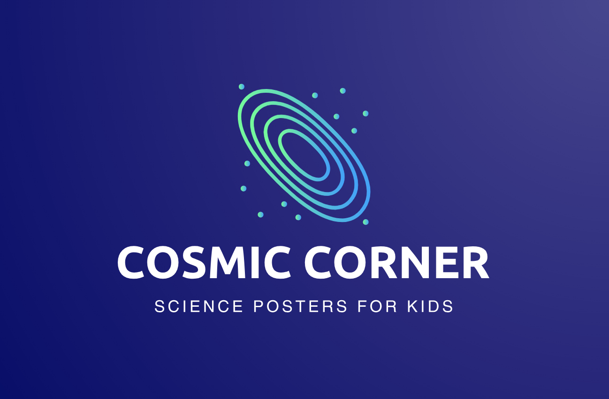

# Cosmic Corner - Posters Site

[Live Link](https://posters-site.cyclic.app/) (Currently migrating website. If site shows error or loads basic HTML, just refresh!)

Welcome to the Cosmic Corner Posters Site! This is a web application that allows users to browse through a collection of posters, add them to their cart, securely checkout, and make payments. The project is built using JavaScript, HTML, CSS, Bootstrap, Stripe API, Node.js, Express, Passport for authentication, and MongoDB for the database.



## Features

- **Browse Posters**: Users can explore a diverse collection of posters available for purchase.
- **Cart Functionality**: Users can add posters to their cart and review the selected items.
- **Secure Checkout**: Integrated with the Stripe API to provide secure payment processing.
- **Authentication**: User authentication using Passport, ensuring secure user registration and login.
- **Database Integration**: MongoDB is used to store user data, poster details, and order information.
- **Responsive Design**: The application is responsive and user-friendly across various devices.

## Installation

1. Clone the repository:
   ```
   git clone https://github.com/marsha-tiisa/posters-site.git
   cd posters-site
   ```

2. Install dependencies:
   ```
   npm install
   ```

3. Set up environment variables:
   - Create a `.env` file in the project root.
   - Add your Stripe API key, MongoDB connection URI, and any other required environment variables.
   ```
   STRIPE_SECRET_KEY=your_stripe_secret_key
   MONGODB_URI=your_mongodb_connection_uri
   SESSION_SECRET=your_session_secret
   ```

4. Start the server:
   ```
   npm start
   ```

5. Open your browser and navigate to `http://localhost:9000` to access the application.

## Usage

1. Browse through the available posters and select the ones you want to purchase.
2. Add selected posters to your cart.
3. Review the items in your cart and proceed to checkout.
4. Enter your payment information securely using the Stripe payment gateway.
5. Upon successful payment, you'll receive an order confirmation and the posters will be on their way to you!
